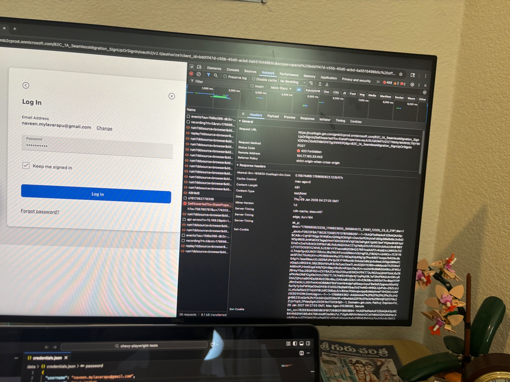
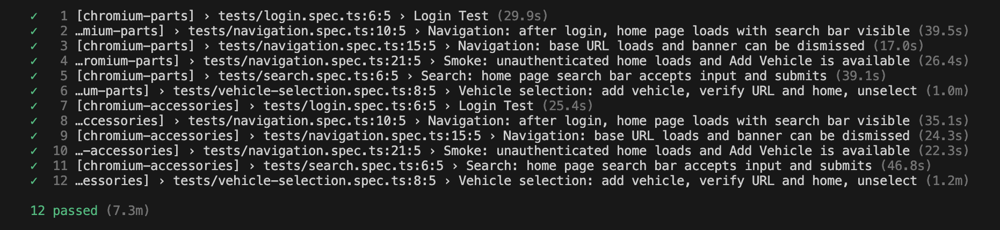

# Chevrolet E-Commerce Test Automation Framework

Scalable Playwright + TypeScript framework for Chevrolet **parts** and **accessories** sites (parts.chevrolet.com, accessories.chevrolet.com), aligned with the QA Automation Engineer take-home assignment.

---

## Quick Start

```bash
npm install
npx playwright install
```

**First-time auth (required):** Log in once manually and save session state:

```bash
npm run setup-auth:manual
```

Then run tests:

```bash
npx playwright test
```

---

## Setup

### 1. Install Dependencies

```bash
npm install
```

### 2. Install Browsers

```bash
npx playwright install
```

### 3. Authentication (Required)

GM/Chevrolet login often blocks automated requests (**403 Forbidden**). When you submit the login form, the POST to `custlogin.gm.com` (e.g. SelfAsserted) can return 403, and you may also see protocol errors (e.g. `ERR_HTTP2_PROTOCOL_ERROR`) when loading the site. Tests avoid this by using **saved auth state** from a one-time manual login.



1. Set `data/credentials.json` with your account and the **exact** header name after login:

   ```json
   {
     "username": "your.email@example.com",
     "password": "YourPassword",
     "profileName": "YourFirstName"
   }
   ```

2. Run manual auth setup:

   ```bash
   npm run setup-auth:manual
   ```

3. In the opened browser: **My Account → Sign In → email → Continue → password → Log In**.  
   When the header shows your name, the script saves `storage/auth-parts.json` and `storage/auth-accessories.json`.

4. Run tests; they load this state and skip the login UI when already authenticated.

Re-run `npm run setup-auth:manual` when the session expires.

---

## Running Tests

### By site (multi-site support)

- **Parts only:**  
  `npx playwright test --project=chromium-parts`

- **Accessories only:**  
  `npx playwright test --project=chromium-accessories`

- **Both sites:**  
  `npx playwright test`

The **project** determines the base URL (parts vs accessories). No need to set `SITE` when using `--project`.

### Parallel execution and retries

- **Workers:** Default is **2** (parallel). Override: `npx playwright test --workers=1` for sequential.
- **Retries:** Default is **1** retry per test on failure. Override: `npx playwright test --retries=0` for no retries.

### Other options

- Headed (see browser): `npx playwright test --headed`
- Single file: `npx playwright test tests/vehicle-selection.spec.ts`
- HTML report: `npx playwright show-report playwright-report` (generated after each run)

---

## Docker (optional)

Docker is **optional**. If Docker is not installed on your machine, run tests locally with **Quick Start** above (`npm install`, `npx playwright install`, `npm run setup-auth:manual`, then `npx playwright test`).

When Docker is available, tests can run inside a container using the official Playwright image (Node + browsers and system deps).  
**Run all Docker commands from the project root** (the folder that contains `docker-compose.yml`, `Dockerfile`, and the `tests/` directory).

### Build

```bash
docker compose build
# or
docker build -t chevy-playwright-tests .
```

### Run all tests

```bash
docker compose run --rm playwright
# or
docker run --rm --ipc=host --init -v $(pwd)/test-results:/app/test-results chevy-playwright-tests
```

### Run a subset

```bash
docker compose run --rm playwright npx playwright test --project=chromium-parts
docker compose run --rm playwright npx playwright test tests/navigation.spec.ts
```

### Auth state (optional)

Tests that need login use saved auth from `storage/`. To use it in Docker, mount the host `storage/` (and optionally `data/` for credentials) when running:

```yaml
# In docker-compose.yml, uncomment:
volumes:
  - ./storage:/app/storage
  # - ./data:/app/data   # if credentials must be inside container
```

Create auth state on the host first: `npm run setup-auth:manual`, then run with the volume mounted.

### Notes

- **`--ipc=host`** is recommended for Chromium in containers (avoids OOM issues).
- **`--init`** avoids zombie processes.
- **test-results** is mounted so reports and traces are on the host; adjust the path if needed.
- The image tag in `Dockerfile` (e.g. `v1.49.0-noble`) should match your `@playwright/test` version.

---

## Framework Architecture

### Page Object Model (POM)

| Page | Responsibility |
|------|----------------|
| **`pages/auth.page.ts`** | Login, “already logged in” check, banner dismiss, logout. Uses project baseURL via `page.goto('/')`. |
| **`pages/vehicle.page.ts`** | Add vehicle: wait for page ready → + Add Vehicle → Year → Model → Body/Door (optional) → Add Vehicle; categories URL assertion. |
| **`pages/home.page.ts`** | Home checks, vehicle card (verify present, unselect), search bar and search submit. |

Single responsibility: each page owns locators and actions for its screen.

### Custom Fixtures (`fixtures/fixtures.ts`)

- **`page`** – Extended with banner CSS hide and auto-dismiss on every navigation.
- **`auth`** – `AuthPage` instance.
- **`home`** – `HomePage` instance.
- **`vehicle`** – `VehiclePage` instance.

Tests request only what they need (e.g. `{ auth, home, vehicle }`).

### Multi-Site Support

- **Sites:** `https://parts.chevrolet.com/`, `https://accessories.chevrolet.com/`.
- **Config:** Two Playwright projects; each sets its own `baseURL`. Tests use `page.goto('/')` so the correct site is loaded per project.
- **Auth state:** Separate storage files per site (`storage/auth-parts.json`, `storage/auth-accessories.json`).

### Test Data

- **`data/vehicles.json`** – Year → model, body button label, door option label (drives vehicle selection).
- **`utils/vehicle.util.ts`** – `getVehicleForYear(year)`, `getRandomVehicleYear()`.
- Tests use this data for data-driven vehicle selection; no hardcoded years/models in specs.

### Banner / Modal Handling

- **Primary:** `dismissBanner(page)` in `utils/banner.util.ts` – waits for `.q-close-modal-button`, clicks it, then fallbacks (other close buttons, Escape, backdrop). Force-click used when needed.
- **Backup:** Fixture injects `hideBannerByCss(page)` so modals don’t intercept clicks.
- **Usage:** Auth, vehicle, and home flows call `dismissBanner` so the promo modal does not block interactions.

### Centralized waits (`constants/waits.ts`)

All timeouts and delays are defined in **`constants/waits.ts`** so tuning is in one place. Page objects, utils, and specs import from here (e.g. `NAV_TIMEOUT_MS`, `STEP_TIMEOUT_MS`, `HOME_LOADED_MS`). No hardcoded `setTimeout` or magic numbers in tests or pages.

### Custom reporting and error handling

- **Reporters:** `playwright.config.ts` uses **list** (console), **HTML** (`playwright-report/`), and a **custom reporter** (`reporters/customReporter.ts`).
- **Custom reporter:** On each failure it logs `[project] test title` and the error message to the console, and at the end writes a **failure summary** to `test-results/failures.log` (one file per run). Use this for quick inspection of failed tests and project/site context.
- **Artifacts on failure:** Screenshot, video, and trace are retained on failure (`screenshot: 'only-on-failure'`, `video: 'retain-on-failure'`, `trace: 'retain-on-failure'`).

---

## Issues  Faced & How We Debugged

This section documents real issues encountered during development and how they were resolved. Use it when tests fail or when debugging similar problems.

---

### 1. Banner / Promo Modal Blocking Clicks

**Symptom:** Tests timed out waiting for elements (e.g. “My Account”, “+ Add Vehicle”). The page looked loaded, but clicks never registered.

**Cause:** A promotional modal (“SAVE NOW! 20% Off* Batteries”, etc.) was overlaying the page. Until it was closed, the DOM was effectively “frozen” for interaction: buttons were visible but another element (the modal) intercepted pointer events. In some cases the modal used structures that made the close button hard to target (e.g. SVG icon, or multiple elements with “My Account” causing strict-mode violations).

**How I debugged:**

- Ran tests in **headed** mode (`npx playwright test --headed`) to see the modal.
- Used **Playwright trace** on failure:  
  `npx playwright show-trace test-results/<test-folder>/trace.zip`  
  to see which element was receiving the click and what was visible.
- In DevTools, inspected the modal (e.g. `#MarketingPromoPopup`, `.q-close-modal-button`, `.modal-header svg`) to get reliable selectors.

**Fixes applied:**

- **Centralized dismissal:** All flows that need a clean page now call `dismissBanner(page)` (and the fixture runs it on every navigation).
- **Multiple strategies in `dismissBanner`:**  
  - Primary: `.q-close-modal-button` (assignment selector), with force-click fallback.  
  - Fallbacks: `#MarketingPromoPopup .q-close-modal-button`, `.modal-header` (button/svg), `.svg-inline--fa.fa-times-circle`, generic “close/dismiss/x” button, then Escape + backdrop click.
- **Fixture-level backup:** `hideBannerByCss(page)` injects CSS to hide common promo modals so they don’t block even if the close button is hard to click.
- **No reload before Add Vehicle:** We removed an extra `page.reload()` in the vehicle flow so the page object and DOM stay in sync and the banner is dismissed on the current document.

**Takeaway:** If tests hang on “visible” elements, check for an overlay/modal and ensure dismissal runs after every navigation and before critical clicks. Use trace + headed mode to confirm what’s on screen.

---

### 2. Wrong Site (Accessories URL Not Used)

**Symptom:** When running the **chromium-accessories** project, tests still opened parts.chevrolet.com instead of accessories.chevrolet.com.

**Cause:** Login (and some navigation) used `getBaseUrl(env, site)` where `env` and `site` came from **process environment** (`ENV`, `SITE`). When running both projects in one run, `SITE` was not set, so `site` defaulted to `'parts'`. So every project (including accessories) was navigating to the parts URL.

**How I debugged:**

- Noticed that both projects were hitting the same base URL.
- Checked that Playwright projects each set their own `baseURL` in config, but our code was calling `page.goto(siteUrl)` with a URL built from process env, overriding the project’s baseURL.

**Fixes applied:**

- **Use project baseURL for navigation:**  
  `auth.login()` and the “base URL loads” test now call `page.goto('/')` instead of `page.goto(getBaseUrl(env, site))`.  
  Playwright resolves `'/'` against the **current project’s** `baseURL`, so chromium-parts goes to parts, chromium-accessories to accessories.
- Removed dependency on `env`/`site` fixtures for navigation; tests no longer pass these into `auth.login()` for the initial load.

**Takeaway:** For multi-site setups, prefer `page.goto('/')` (or relative paths) so the project’s `baseURL` always decides the site. Avoid building the start URL from process env when multiple projects run in the same process.

---

### 3. “Playwright Test did not expect test() to be called here” / No tests found

**Symptom:** All tests failed with “test() not expected here” or “No tests found”, often pointing at a file like `feature.spec.ts` or an import from `../utils/auth.helper`.

**Cause:**  
- **Wrong working directory:** Playwright was run from a different folder (e.g. `~/tests`) that had its own config and a different spec (e.g. `feature.spec.ts`) importing `../utils/auth.helper`. That path didn’t exist in the chevy-playwright-tests repo, so loading failed and test discovery broke.  
- **Test discovery including non-spec files:** If the config matched non-spec files (e.g. fixture files), Playwright could load them as tests and then complain about where `test()` was called.

**How I debugged:**

- Checked the error stack: it referenced a file path **outside** the project (e.g. `/Users/<you>/tests/feature.spec.ts`).
- Verified that we always run from the **project root**:  
  `cd /path/to/chevy-playwright-tests && npx playwright test`.

**Fixes applied:**

- **Strict test match:** In `playwright.config.ts`, set `testMatch: /.*\.spec\.ts/` and `testIgnore: ['**/node_modules/**', '**/fixtures/**']` so only `*.spec.ts` under `testDir` are treated as tests and fixture files are never loaded as specs.
- **Run from project root:** Documented that tests must be run from the repo root (or with an explicit config path).

**Takeaway:** Always run Playwright from the project root. If you see “test() not expected here” or “No tests found”, check the path in the error and ensure only real spec files are matched and that no config from another directory is used.

---

### 4. ERR_HTTP2_PROTOCOL_ERROR and 403 Forbidden on login

**Symptom:** Tests failed with:

- `page.goto: net::ERR_HTTP2_PROTOCOL_ERROR at https://accessories.chevrolet.com/`
- Or, when automating login: the POST to `custlogin.gm.com` (e.g. `SelfAsserted?tx=...`) returns **403 Forbidden** in the Network tab (see [docs/login-403-forbidden.png](docs/login-403-forbidden.png)).

**Cause:** Transient HTTP/2 protocol errors on navigation, and/or GM’s login server (behind Akamai) refusing automated auth (403). The screenshot shows the Log In form with email/password and the Network tab with the 403 response on the SelfAsserted request.

**How I debugged:**

- Confirmed the error in the failure message and in trace/screenshots.
- Checked that the same test could pass on a retry or later run.

**Fixes applied:**

- **Retry `page.goto` once in `auth.login()`:** On the first failure, wait 2 seconds and call `page.goto('/', gotoOpts)` again. Many transient protocol errors succeed on a second attempt.
- If the accessories site is consistently down or blocking automation, the retry won’t fix that; it only helps with flaky network/protocol errors.

**Takeaway:** For critical navigations (e.g. initial load), a single retry on failure can reduce false failures due to transient network/protocol errors. Document this in the README so future maintainers know why the retry exists.

---

### 5. Body / Door Step Timeout (“Body Sport Utility” button)

**Symptom:** Vehicle selection test failed with timeout waiting for `getByRole('button', { name: 'Body Sport Utility' })`.

**Cause:** The body dropdown can be implemented in different ways: sometimes a button shows the full label “Body Sport Utility,” sometimes only “Body” as the trigger, with “Sport Utility” or “Door - Sport Utility” as options. Relying on a single selector made the test brittle.

**How we debugged:**

- Reproduced in headed mode and inspected the body/door controls.
- Compared with the assignment’s expected flow (Body Sport Utility → Door - Sport Utility) and the actual DOM.

**Fixes applied:**

- **Resilient body/door step in `vehicle.page.ts`:**  
  - Try clicking a button with the exact `bodyButtonLabel` (e.g. “Body Sport Utility”).  
  - If not found, try a button matching “Body” (e.g. `/Body\b/`).  
  - After either, wait for and click the door option (e.g. “Door - Sport Utility”).  
  - If the body/door step still doesn’t complete (e.g. not present for that model), we skip it and continue to “Add Vehicle” so tests don’t fail for vehicles that don’t have that step.
- Slightly increased delay after model selection so the body dropdown has time to appear.

**Takeaway:** For optional or variable UI (body/door), use a small “try A, then B” strategy and allow the test to continue when the step is not present, instead of a single rigid selector.

---

### 6. Location / Geolocation Prompt

**Symptom:** Browser kept asking for location permission, which could block or slow tests.

**Cause:** The site may request geolocation; without a default, the browser shows a prompt.

**Fixes applied:**

- In `playwright.config.ts`, set `permissions: ['geolocation']` and a default `geolocation: { latitude, longitude }` so the browser doesn’t prompt and tests run in a predictable state.

---

## Screenshots & Troubleshooting

When a test fails, use the artifacts Playwright generates:

- **Screenshot:** `test-results/<test-name>/test-failed-1.png` – last frame before failure.
- **Trace:** `test-results/<test-name>/trace.zip` – full timeline of actions and DOM.  
  Open with:  
  `npx playwright show-trace test-results/<test-name>/trace.zip`
- **Video:** `test-results/<test-name>/video.webm` – recording of the run (if enabled).

**Common checks:**

1. **Modal overlay:** If the screenshot shows a promo/modal, the failure is likely due to the banner (see “Banner / Promo Modal” above). Ensure `dismissBanner` runs and that the close selectors match the current site.
2. **Wrong site:** If the URL in the screenshot is not the one you expected (e.g. parts vs accessories), ensure you’re using the right project and that navigation uses `page.goto('/')` (see “Wrong Site” above).
3. **Network/protocol error or 403 on login:** If the error is `ERR_HTTP2_PROTOCOL_ERROR` or you see **403 Forbidden** on `custlogin.gm.com` in the Network tab, see “ERR_HTTP2_PROTOCOL_ERROR and 403 Forbidden” above. Use saved auth state (`npm run setup-auth:manual`) instead of automating login.
4. **Body/Door timeout:** If the failure is on the body or door step, check “Body / Door Step Timeout” and the resilient body/door logic in `vehicle.page.ts`.

**Reference screenshot – Login 403 Forbidden:**  
[docs/login-403-forbidden.png](docs/login-403-forbidden.png) shows the GM Log In form (email/password) and the DevTools Network tab with a **403 Forbidden** response on the POST to `custlogin.gm.com` (SelfAsserted). This is why the framework uses manual login once and saved storage state.

---

## Test Suite

| Test | Description |
|------|-------------|
| **Login** (`login.spec.ts`) | Login (or use saved state), assert profile button visible. |
| **Vehicle selection** (`vehicle-selection.spec.ts`) | Login → add vehicle (random year from data) → assert URL contains “categories” → verify home → verify vehicle present → unselect vehicle → verify removed. No logout at end. |
| **Vehicle cancel** (`vehicle-cancel.spec.ts`) | Login → open Add Vehicle modal → cancel (Escape) without adding → assert “+ Add Vehicle” still visible and URL does not contain “categories”. |
| **Search** (`search.spec.ts`) | (1) Login → verify home → type “oil filter” in search → submit → wait for search complete → assert search input visible. (2) **No-results:** Same flow with query “xyznonexistent999”; assert search completes and input remains visible. |
| **Navigation** (`navigation.spec.ts`) | (1) After login, home loads and search bar visible. (2) Base URL loads and banner can be dismissed. (3) **Smoke:** Unauthenticated home loads and “+ Add Vehicle” is available. |

### Sample run results

Full suite run against both **chromium-parts** and **chromium-accessories** (12 tests total, ~7.3 minutes):



| Context | Tests | Notes |
|--------|--------|------|
| `[chromium-parts]` | 6 tests | Login, Navigation (2), Smoke, Search, Vehicle selection |
| `[chromium-accessories]` | 6 tests | Same suite on accessories site |
| **Total** | **12 passed** | ~7.3m |

---

## How to Add New Tests

1. Import the custom fixtures:  
   `import { test, expect } from '../fixtures/fixtures';`

2. Use the fixtures you need:  
   `test('my scenario', async ({ auth, home, vehicle }) => { ... });`

3. Prefer **page objects** under `pages/` for selectors and flows; keep test data in `data/` and helpers in `utils/`.

4. For a new site-specific flow, add or extend a project in `playwright.config.ts` and keep using `page.goto('/')` so the project’s baseURL is used.

---

## Environment

- **Node:** LTS (e.g. 18+).
- **Optional env vars:**
  - `ENV` – dev | staging | prod (default: prod). Used for top-level config; per-project baseURL is set in config.
  - `BANNER_CLOSE_SELECTOR` – Custom close locator if the default `.q-close-modal-button` does not match.

---

## Assumptions and Decisions

- **Auth:** GM may block automated login (403). Framework uses manual login once and saved storage state. Credentials in `data/credentials.json`; `profileName` must match the header text after login.
- **Banner:** Primary strategy is wait for `.q-close-modal-button` and click (with fallbacks and CSS hide in the fixture). If the site changes, extend `dismissBanner` or set `BANNER_CLOSE_SELECTOR`.
- **Vehicle flow:** Year → Model → Body (if present) → Door → Add Vehicle; assertion on URL containing “categories”. Body/Door step is resilient (multiple selectors, skip if not found).
- **Multi-site:** Parts and accessories are separate projects; navigation uses `page.goto('/')` so the correct site loads per project.
- **Test data:** `data/vehicles.json` drives year/model/body/door; add more entries as needed.

---

## Repository Structure

```
├── data/
│   ├── credentials.json   # Not committed; credentials + profileName
│   └── vehicles.json      # Year → model, body, door labels
├── docs/
│   ├── login-403-forbidden.png       # Screenshot: 403 on GM login (README)
│   └── test-execution-results.png    # Screenshot: sample run 12 passed (README)
├── Dockerfile             # Playwright image + app; run tests in container
├── docker-compose.yml     # Build and run: docker compose run --rm playwright
├── .dockerignore          # Excludes node_modules, storage, test-results, etc.
├── constants/
│   └── waits.ts          # Centralized timeouts and delays (no magic numbers)
├── fixtures/
│   └── fixtures.ts       # Custom test fixtures (page, auth, home, vehicle)
├── pages/
│   ├── auth.page.ts
│   ├── home.page.ts
│   └── vehicle.page.ts
├── reporters/
│   └── customReporter.ts # Failure summary to console + test-results/failures.log
├── tests/
│   ├── login.spec.ts
│   ├── vehicle-selection.spec.ts
│   ├── vehicle-cancel.spec.ts
│   ├── search.spec.ts
│   └── navigation.spec.ts
├── utils/
│   ├── banner.util.ts     # dismissBanner, hideBannerByCss
│   ├── envUtils.ts        # ENV/SITE, base URLs
│   └── vehicle.util.ts    # Vehicle data helpers
├── scripts/
│   ├── setup-auth-manual.ts
│   └── setup-auth.ts
├── storage/               # Auth state (gitignore in real use)
├── playwright.config.ts
├── tsconfig.json
└── package.json
```

## Scripts

| Script | Purpose |
|--------|--------|
| `npm test` / `npx playwright test` | Run all tests (default: both projects). |
| `npm run setup-auth:manual` | Open browser to log in manually and save auth state for both sites. |
| `npm run setup-auth` | Attempt programmatic login (often blocked by GM; prefer manual). |
| `docker compose build` | Build the Playwright Docker image. |
| `docker compose run --rm playwright` | Run all tests in Docker; use `... playwright npx playwright test <args>` for options. |
